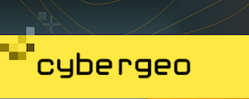
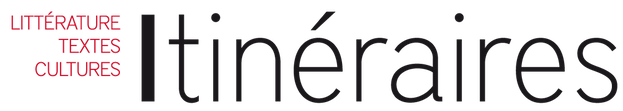
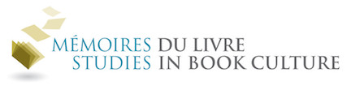
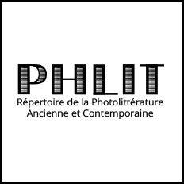

## Revue 2.0

#### journées de lancement

&nbsp;

4 et 5 oct. 2018 | Montréal

---

<!-- .element: style="font-size:1.5rem" -->

 <!-- .element: class="logo" style="height:50px; background-color:ghostwhite;padding: 4px" -->
 <!-- .element: class="logo" style="height:50px; background-color:ghostwhite;padding: 4px" -->  

===

%%%%%%%%%%%%%%%%%%SECTIONmoveRight%%%%%%%%%%%%%%%%%%

## Plénière
<!-- .element: style="width:55%; float:left;" -->

- Introduction
- Objectifs
- Pistes théoriques
- Partenariat
- Déroulé du lancement
- Tour de table

<!-- .element: style="font-size:0.8em; width:35%; float:left;padding-left:2rem;border-left:1px,solid,white;" -->

§§§§§SLIDEmoveDown§§§§§

### Introduction

Constat de départ :

<i class="fa fa-arrow-right"></i> un nouvel environnement de production et de diffusion

<!-- .element: style="font-size:1.8rem" -->

<i class="fa fa-arrow-right"></i> la nécessité d'une réflexion nouvelle

<!-- .element: style="font-size:1.8rem" -->

===
> Si les revues savantes en sciences humaines ont désormais achevé — ou presque — leur transition
numérique (surtout en matière de production et de circulation), force est de constater qu'elles sont encore
loin d'exploiter pleinement toutes les potentialités offertes par le web. En collaborant avec les principaux
acteurs de la communication scientifique (éditeurs, diffuseurs, agrégateurs), ce projet de développement
partenariat vise à mieux répondre aux besoins émergents des chercheurs, en repensant le rôle des revues
savantes à l'ère du numérique.

besoin de se poser les questions épistémologique derriere les nouveaux modes de diffusion et de légitimation
le projet, c'est le temps pour produire cette réflexion

ce n'est pas une réflexion technique, le vrai enjeu, c'est de mettre ensemble une tradition lettrée qui a des siècles, avec des compétences pointues et des possiblités exponentiell dans le domaine du num, mais dont les application et enjeux ne sont pas à portée de main des chercheurs en sciences humaines.

§§§§§SLIDEmoveDown§§§§§

### Objectifs

<i class="fa fa-arrow-right"></i>  modèles épistémologiques

<!-- .element: style="font-size:0.9em" -->

<i class="fa fa-arrow-right"></i>  modèles éditoriaux

<!-- .element: style="font-size:0.9em" -->

===
- proposer un modèle épistémologique pour les revues savantes en shs à l'époque du numérique
- proposer des modèles éditoriaux concrets, avec des outils adaptés aux pratiques, aux cultures et aux besoins

- qu'est ce qu'une revue ?
- qu'est ce qu'on voudrait qu'une revue soit ?

- un enjeu de capacitation, d'empowerment, de littératie : accompagner les revues et leurs auteurs dans un apprentissage ciblé.

§§§§§SLIDEmoveDown§§§§§

### Pistes théoriques

<i class="fa fa-arrow-right"></i>  conversation

<!-- .element: style="font-size:0.9em" -->

<i class="fa fa-arrow-right"></i>  espace public

<!-- .element: style="font-size:0.9em" -->

===

- comment l'environnemnt numérique peut être mis au service d'un renouvellement de la vocation des revues ?
- la piste  principale pour nous, c'est la conversation.
 la revue, à l'époque où la possibilité de diffusion des contenus est mulitipliée par les possibilités du numérique, la piste, c'est d'aller revoir la vocation initiale des revues : d'être un espace pour la conversation savante.
- la revue ne doit pas le lieu de la diffusion des résultats de recherche, c'est le lieu de la production des résultats de recherche de la communauté, surtout en shs.

- la piste de l'espace public

§§§§§SLIDEmoveDown§§§§§

### Le partenariat

<i class="fa fa-arrow-right"></i>  des revues

<!-- .element: style="font-size:0.9em" -->

<i class="fa fa-arrow-right"></i>  les diffuseurs

<!-- .element: style="font-size:0.9em" -->

<i class="fa fa-arrow-right"></i>  des chercheurs

<!-- .element: style="font-size:0.9em" -->

&nbsp;

 <!-- .element: style="height:40px;background:whitesmoke;border:1px" -->
 <!-- .element: style="height:40px;background:whitesmoke;border:1px" -->
<!-- .element: style="height:40px;background:whitesmoke;border:1px" -->
 <!-- .element: style="height:40px;background:whitesmoke;border:1px" -->
 <!-- .element: style="height:40px;background:whitesmoke;border:1px" -->
 <!-- .element: style="height:40px;background:whitesmoke;border:1px" -->
 <!-- .element: style="padding:3px;height:40px;background:whitesmoke;border:1px" -->
 <!-- .element: style="padding:3px;height:40px;background:whitesmoke;border:1px" -->
 <!-- .element: style="padding:3px;height:40px;background:whitesmoke;border:1px" -->

===

ce n'est pas qu'une chose technique, ni qu'une chose savante, il faut mettre ensemble ces deux pôles de la recherche.

§§§§§SLIDEmoveDown§§§§§
### Planning

|périodes | phases|
|:--|:--|
|oct. 2018 | Lancement|
|oct. 2018 - mars 2019 | Observation des pratiques|
|mars-sept.  2019 | Conception   |
|sept. 2019 - sept 2020  |Expérimentations   |
|sept. 2020 - sept 2021  |Finalisations   |

===
- on est ici pour penser la structuration du projet, le projet est amené à s'adapter.
- il est aussi probable que toutes les revues n'avancent pas au même rythme.

§§§§§SLIDEmoveDown§§§§§

### Déroulé des journées

||**Jour 1**||
|:--|:--|--:|
| 10h | Plénière |  2h |
| 12h | _déjeuner_| |
| 13h | Atelier 1 : Production | 1h30 |
| 14h30 | _pause_| |
| 14h45 | Atelier 2 : Diffusion|  1h |
| 15h45 | _pause_| |
| 16h | Atelier 3 : Outils|  1h |
| 17h | _fin de la première journée_| |

<!-- .element: style="font-size:0.6em; width:45%; float:left;" -->

||**Jour 2**||
|:--|:--|--:|
| 9h | Atelier 4 : Protocole d'observation|  3h |
| 12h | _déjeuner_| |
| 13h | Atelier 5 : Brainstorm séminaire | 1h30 |
| 14h30 | _pause_| |
| 15h | Clôture des journées  |  1h |
| 16h | _fin de la seconde journée_| |

<!-- .element: style="font-size:0.6em; width:45%; float:left;margin-left:20px;border:1px,solid,white;" -->

===

objectif : on démarre la recherche aujourd'hui

- schedule
- objectif de ateliers

§§§§§SLIDEmoveDown§§§§§

### Tour de table - revues

1. Cybergéo (Christine Kosmopoulos)
2. Études Françaises (Elisabeth Nardout-Lafarge et Jean-Benoit Cormier-Landry)
3. Intermédialités (Marion Froger et Maude Trottier)
4. Itinéraires (François-Xavier Mas)
5. Mémoires du livre (Anthony Glinoer)
6. Revue internationale de photolittérature (Servanne Monjour)
7. Captures (Bertrand Gervais)
8. Humanités Numériques (Emmanuel Chateau-Dûtier)

<!-- .element: style="font-size:1.7rem" -->

§§§§§SLIDEmoveDown§§§§§

### Tour de table - institutions

1. OpenEdition (Marin Dacos et Elodie Faath)
2. Huma-num (Stéphane Pouyllau)
3. Érudit (Tanja Niemann et Émilie Paquin)

<!-- .element: style="font-size:1.7rem" -->

§§§§§SLIDEmoveDown§§§§§

### Tour de table - chercheurs

1. Maude Bonenfant (Université du Québec à Montréal)
2. Renée Bourassa (Université Laval)
3. Susan Brown (University of Guelph)
4. Joana Casenave (Université de Lille)
5. Emmanuel Chateau-Dutier (Université de Montréal)
6. Constance Crompton (Université d’Ottawa)
7. Juliette De Maeyer (Université de Montréal)
8. Michael Eberle-Sinatra (Université de Montréal)
9. Bertrand Gervais (Université du Québec à Montréal)
10. Vincent Larivière (Université de Montréal)
11. Pierre Lévy (Université d’Ottawa)
12. Benoît Melançon (Université de Montréal)
13. Servanne Monjour (McGill University)
14. Stéfan Sinclair (McGill University)
15. Louis van Beurden (Université de Montréal)

<!-- .element: style="font-size:1.7rem" -->

%%%%%%%%%%%%%%%%%%SECTIONmoveRight%%%%%%%%%%%%%%%%%%

## Atelier.1 Production
<!-- .element: style="width:50%; font-size:1.2em; float:left;" -->

- Objectifs de l'atelier
- Récapitulatif des chaînes éditoriales
- Discussion sur les besoins et les problèmes

<!-- .element: style="font-size:0.8em; width:45%;border-left:1px,solid,white;" -->

===

- l'objectif de l'atelier est d'amener les revues à expliciter leurs problématiques (autres que la problématique du modèle économique).
- comprendre les besoins des revues, identification des problématiques et définir des objectifs pour le projet

§§§§§SLIDEmoveDown§§§§§

### quelques axes..

- ruptures et continuités dans vos chaînes éditoriales
- rôles et fonctions
- internet, ce postier

%%%%%%%%%%%%%%%%%%SECTIONmoveRight%%%%%%%%%%%%%%%%%%

## Atelier.2 Diffusion
<!-- .element: style="width:55%; font-size:1.2em; float:left;" -->

- Présentation des chaines de traitement
- Discussion

<!-- .element: style="font-size:0.8em; width:35%; float:left;padding-left:2rem;border-left:1px,solid,white;" -->

===

§§§§§SLIDEmoveDown§§§§§

### quelques axes..

- structuration et pérennité
- continuité production-diffusion
- enrichissement et agrégation

===

- la question de la structuration des contenus et les enjeux de pérennité (qualité du document)
- la question de la continuité entre les chaines de production et de diffusion : pour le moment rupture flagrante, comment reconstruire une continuité.
- la question des données, de leur richesse : force des schémas actuels, qu'est ce qui leur manque, comment les améliorer

%%%%%%%%%%%%%%%%%%SECTIONmoveRight%%%%%%%%%%%%%%%%%%

## Atelier.3 présentation des outils
<!-- .element: style="width:50%; font-size:1.2em; float:left;" -->

- Stylo (M. Vitali-Rosati)
- IEML (P. Levy)
- Lincs (S. Brown)
- recherche isidore (Huma-num)
- CMS NT2 (B. Gervais)

<!-- .element: style="font-size:0.8em; width:45%; border-left:1px,solid,white;" -->

§§§§§SLIDEmoveDown§§§§§

%%%%%%%%%%%%%%%%%%SECTIONmoveRight%%%%%%%%%%%%%%%%%%

## Atelier.4 observation des pratiques
<!-- .element: style="width:50%; font-size:1.2em; float:left;" -->

§§§§§SLIDEmoveDown§§§§§

1. objectif de l'atelier
2. quelles données récolter ?
3. comment les récolter ?
4. aspects pratiques

&nbsp;

<i class="fa fa-arrow-right"></i> [frama.link/R20-atelier4](https://frama.link/R20-atelier4)

===

objectif : définir un protocole d'observation

modalités de l'observation

%%%%%%%%%%%%%%%%%%SECTIONmoveRight%%%%%%%%%%%%%%%%%%

## Atelier 5 - brainstorm séminaire
<!-- .element: style="width:50%; font-size:1.2em; float:left;" -->

problématique

> qu'est ce qu'une revue ?
>
> qu'est ce que doit être une revue à l'ère du numérique ?

§§§§§SLIDEmoveDown§§§§§

%%%%%%%%%%%%%%%%%%SECTIONmoveRight%%%%%%%%%%%%%%%%%%

## Conclusion
<!-- .element: style="width:50%; font-size:1.2em; float:left;" -->

§§§§§SLIDEmoveDown§§§§§

%%%%%%%%%%%%%%%%%%SECTIONmoveRight%%%%%%%%%%%%%%%%%%

### Merci !

<i class="fa fa-arrow-right"></i> présentation : [ecrituresnumeriques.github.io/s_Revue20](https://ecrituresnumeriques.github.io/s_Revue20)

<!-- .element: style="font-size:0.7em;" -->

---
 <!-- .element: class="logo" style="width:25%; background-color:ghostwhite;padding: 7px" -->

===

.slide: data-background-image="img/" data-background-size="cover"
.slide: class="hover"

<!-- .element: style="font-size:1.7rem" -->
<!-- .element: style="font-size:1.7rem; text-align:left; padding-left:1rem;" -->

pour baliser en inline
- yaml <!-- .element: style="color:Darkorange;" -->

pour faire deux colonnes
<!-- .element: style="font-size:0.6em; width:55%; float:left;" -->
<!-- .element: style="font-size:0.6em; width:35%; float:left;padding-left:2rem;border:1px,solid,white;" -->
